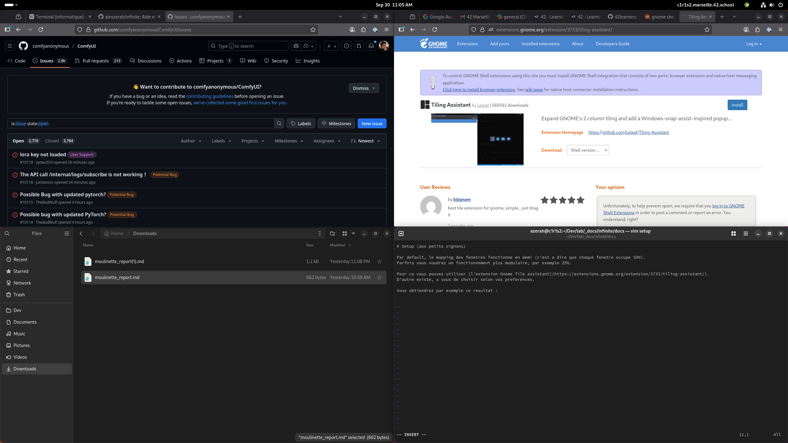

# Setup (aux petits oignons)

Par default, le mapping des fenetres fonctionne en demi (c'est a dire que chaque fenetre occupe 50%).
Parfois vous voudrez un fonctionnement plus modulaire, par exemple 25%.

Pour ca vous pouvez utiliser [l'extension Gnome Tile assistant](https://extensions.gnome.org/extension/3733/tiling-assistant/).
D'autre existe, a vous de choisir selon vos preferences.

Vous obtiendrez par exemple ce resultat (4 fenetres au lieu de 2) : 

